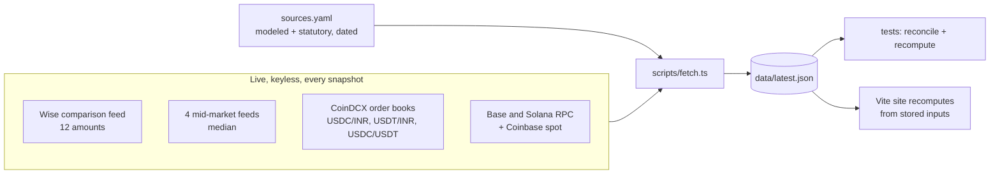

# Rail Watch

Live: https://rail-watch.vercel.app

What it really costs to send dollars from a US bank account to an Indian one, by route, hop by hop, with every number cited.

Rail Watch compares bank wires, remittance providers (Wise, Remitly, Western Union and others) and a USDC route (USD to USDC on Coinbase, on-chain on Base or Solana, sold for INR on CoinDCX). Every route is measured against one mid-market rate, and every fee, spread and tax is broken out as its own hop and tied to a dated entry in [`sources.yaml`](sources.yaml).

> **Not financial, tax or legal advice.** Rail Watch is a cost comparison built from public data and stated assumptions. Your bank, provider, tax position and the law may differ from what is modeled here. Talk to a chartered accountant before acting on the stablecoin numbers.

## What it looks like

Real output of `npm run fetch -- --dry`, captured 4 October 2026, 13:03 UTC, on an Apple Silicon Mac (Node 22.14). It was a Sunday, so most bank and provider quotes are Friday's; the CoinDCX order book is live. The committed `data/latest.json` was fetched earlier the same day, so the USDC line on the site differs slightly.

```text
Sending $1,000 to India today: a Chase wire loses ₹3,604, Remitly loses ₹244, the USDC via Solana route lands ₹366 above mid-market even after tax. Here's every hop.
mid 96.2744 (median of 4 sources)
  USDC via Solana    ₹   96,640  loss ₹   -366    -38 bps
  USDC via Base      ₹   96,640  loss ₹   -366    -38 bps
  Remitly            ₹   96,030  loss ₹    244     25 bps
  Western Union      ₹   95,814  loss ₹    461     48 bps
  Instarem           ₹   95,646  loss ₹    629     65 bps
  WorldRemit         ₹   95,492  loss ₹    782     81 bps
  Wise               ₹   95,068  loss ₹  1,207    125 bps
  Wells Fargo wire   ₹   93,213  loss ₹  3,061    318 bps
  Chase wire         ₹   92,671  loss ₹  3,604    374 bps
  OFX                ₹   92,064  loss ₹  4,210    437 bps
  SWIFT in USD       ₹   89,655  loss ₹  6,619    688 bps
dry run: nothing written
```

A negative loss means the route landed more than mid-market. For the USDC route that is the Indian exchange premium on stablecoins, not a cheaper pipe: see [Limitations](#limitations-and-regulatory-caveats). The site shows the same table as a chart, plus a hop-by-hop waterfall for each route and a table across 12 amounts from $100 to $10,000.

## Why

Comparison sites show the headline rate and fee, and stop there. A USD SWIFT wire to India loses money in four places (the sending fee, an intermediary deduction, the receiving bank's spread and GST on the conversion), and the stablecoin route people quote on X loses it in six different places (network fee, exchange fee, GST on that fee, 1% TDS, a 30% tax on any gain plus cess, and withdrawal). On the snapshot above, the classic USD wire loses ₹6,619 on $1,000 while the best licensed provider loses ₹244. Rail Watch puts every one of those hops on the page with a source and a date, and the hops always add up to the total.

## Quickstart

To just read today's numbers, open [rail-watch.vercel.app](https://rail-watch.vercel.app). It redeploys from `main` whenever a new snapshot is committed, and serves the snapshot itself at [`/data/latest.json`](https://rail-watch.vercel.app/data/latest.json).

To run it yourself: needs Node 22.12 or newer and network access for the fetch step. No API keys, no env vars.

```sh
git clone https://github.com/agnij-dutta/railwatch.git
cd railwatch
npm ci
npm run fetch -- --dry   # pull live quotes, books and gas, print the $1,000 table, write nothing
npm test                 # model math, tax slabs, order-book walking, sources.yaml checks, snapshot reconciliation
npm run build            # typecheck, then static site in dist/ (copies data/ to dist/data/ as a JSON API)
npm run preview          # serve dist/ at http://localhost:4173
```

`npm run dev` serves the site with hot reload instead. `npm run fetch` without `--dry` writes a new snapshot.

## Usage

### Scripts

| Command | What it does |
| --- | --- |
| `npm run fetch` | Fetch every live input, run the model, write `data/latest.json` and `data/history/<YYYY-MM-DD>.json`. |
| `npm run fetch -- --dry` | Same, but print the summary and write nothing. |
| `npm run recompute` | Offline. Re-run the model on the live inputs stored in `data/latest.json` with the current `sources.yaml`. Use it after editing a modeled fee. Add `-- --dry` to print only. |
| `npm test` | Vitest: unit tests for the model and loader, plus reconciliation of the committed snapshot. |
| `npm run lint` / `npm run format` | Biome lint and format check / apply. |
| `npm run typecheck` | `tsc --noEmit`, strict mode. |
| `npm run build` | Typecheck and build the static site into `dist/`. |
| `npm run dev` / `npm run preview` | Dev server / serve the built site. |

### Environment variables

None. Every live source is keyless, and every non-live number is in `sources.yaml`. See [`.env.example`](.env.example).

### `sources.yaml`

Every modeled and statutory number lives here and nowhere else. Each entry has:

| Field | Required | Meaning |
| --- | --- | --- |
| `id` | yes | Stable id. Hops cite it in `sourceIds`. |
| `label`, `publisher`, `url`, `note` | yes | Shown on the methodology page. |
| `status` | yes | `live` (fetched each snapshot), `modeled` (published schedule or explicit assumption) or `statutory` (set by Indian law). |
| `value`, `unit` | modeled and statutory | The number. `unit` is `USD`, `INR` or `fraction`. |
| `as_of` | modeled and statutory | Quoted `YYYY-MM-DD`: when the figure was taken from, or last checked against, the publisher. |
| `param` | when the model reads it | The `ModeledParams` field it sets. |

The loader refuses to run if a modeled or statutory entry lacks a value or date, or if a param is unknown, duplicated or missing.

### Model API (`src/model`)

The model is pure TypeScript with no I/O, shared by the fetcher, the tests and the site.

| Export | Purpose |
| --- | --- |
| `computeRoutes(inputs, amountUsd, opts?)` | Every route for one amount, most INR received first. |
| `providerRoute(quote, amountUsd, midRate)` | A bank or provider route from one Wise-feed quote: upfront fee, then FX markup. |
| `swiftUsdRoute(inputs, amountUsd)` | USD wire, correspondent deduction, conversion in India, GST under Rule 32(2)(b). |
| `stablecoinRoute(inputs, amountUsd, network, opts?)` | Best of the direct and via-USDT paths on `"base"` or `"solana"`. `stablecoinPath` prices one path. |
| `sellIntoBids(bids, qty)` | Walk a bid book best price first. Flags `insufficient` depth. |
| `gstConversionTaxableValue(grossInr)`, `gstOnConversion(grossInr, rate)` | Rule 32(2)(b) slabs. |
| `buildHeadline(routes, amountUsd)` | The one-line summary. |
| `amountRows`, `licensedWinnerRanges`, `stablecoinWins` | The cross-amount table on the site. |
| `Flow`, `valueAtMid` | The balance-tracking engine every route is built on. |
| Types: `RouteResult`, `Hop`, `Snapshot`, `ModelInputs`, `ModeledParams`, `ModelOptions`, `SourceEntry` | See `src/model/types.ts`. |

`ModelOptions`:

| Option | Default | Effect |
| --- | --- | --- |
| `tdsRefunded` | `false` | Credit the TDS back as if fully recovered at tax filing. The site has a toggle for it. |
| `reserveVdaTax` | `true` | Reserve the 30% VDA tax plus cess on any gain over a mid-market cost basis. |

### Data API

`data/latest.json` (served at `dist/data/latest.json` after a build) is the full snapshot: inputs, every computed route with its hops, sources and warnings. `data/history/` keeps one file per day.

## How it works



1. **Inputs.** `scripts/fetch.ts` pulls the Wise comparison feed at 12 amounts, four mid-market feeds, three CoinDCX order books (top 50 bid levels each), Base gas plus the L1 data fee, Solana fees and ETH/SOL spot. It reads every modeled and statutory number from `sources.yaml`. A failed source becomes a warning in the snapshot, never a silent zero. The run aborts if the Wise feed is down or fewer than two mid-market feeds answer.
2. **One yardstick.** Mid-market is the median of Wise, Coinbase, ExchangeRate-API and the ECB rate via Frankfurter. Wise runs the comparison feed and competes in it, so every markup is recomputed against this median rather than taken from Wise.
3. **Routes as balance flows.** A route is a chain of steps on a balance (USD, then maybe USDC or USDT, then INR). After each step the balance is valued at mid-market, stablecoins at par with USD. A hop's cost is how much that value fell. Because each hop is a difference of consecutive balances, the hops sum exactly to `amount x mid - received`. The test suite checks this for every route at every amount in the committed snapshot, and checks that recomputing from the stored inputs reproduces the stored results.
4. **Order books.** The USDC route market-sells the whole amount into the live bid book level by level, so large transfers pay for thin books. It tries USDC/INR directly and USDC to USDT to INR, and keeps whichever lands more. If the stored book cannot absorb the amount, the route is not priced and the snapshot carries a warning.
5. **Site.** The Vite app imports the snapshot's inputs and recomputes routes in the browser, so the amount slider and TDS toggle stay consistent with the tests.

### Methodology summary

| Route | Hops | Data |
| --- | --- | --- |
| Remittance providers and bank FX wires (Wise, Remitly, Western Union, WorldRemit, Instarem, OFX, Chase, Wells Fargo) | Upfront fee, then FX markup vs mid | Live from the Wise feed. Each quote carries its own collection date, which can be days old for banks. |
| SWIFT in USD | Chase USD wire fee, correspondent deduction, conversion at SBI's rate, GST on conversion | Fee and deduction **modeled**; SBI rate live; GST statutory |
| USDC via Base or Solana | ACH to Coinbase, USD to USDC, network fee, exchange deposit, (swap to USDT, swap fee, GST, TDS), sale into the INR book, trading fee, GST on it, TDS, INR withdrawal, VDA tax reserve | Network fee and books live; Coinbase and CoinDCX fees **modeled**; taxes statutory |

Tax math, with the statute behind each line:

- **GST on currency conversion**, CGST Rules 2017, Rule 32(2)(b): 18% of a deemed value of 1% of the gross INR up to ₹1 lakh (minimum ₹250), ₹1,000 + 0.5% of the excess up to ₹10 lakh, ₹5,500 + 0.1% of the excess above that, value capped at ₹60,000. Applied only where a bank converts in India (the SWIFT in USD route).
- **GST on exchange fees**: 18% of the trading and swap fees.
- **TDS**, Income-tax Act 1961 Section 194S (carried into the Income-tax Act, 2025): 1% on every VDA transfer, including the USDC to USDT swap. Base is the consideration net of the exchange's fee and GST, per CBDT Circular 13/2022. Counted as lost by default.
- **VDA tax**, Section 115BBH: 30% of (sale proceeds minus cost of acquisition), no deduction for fees, no loss set-off, plus 4% health and education cess on the tax, so 31.2% effective. Cost basis is the USDC's INR value at mid-market when bought. Reserved only when there is a gain.

Every figure the model computes is an unrounded float; the site rounds to whole rupees only for display (sub-rupee network fees keep paise so they do not read as free).

### Modeled values

These are not fetched live. They are labeled `modeled` on every hop that uses them, on the site's route bars and on the methodology page. Current values from `sources.yaml`:

| Value | Used in | Basis | As of |
| --- | --- | --- | --- |
| $40 Chase outgoing USD wire fee | SWIFT in USD | Chase published schedule, via independent fee guides (Chase's page URL is dead) | 2026-10-04 |
| $20 correspondent bank deduction | SWIFT in USD | **Assumption.** Banks do not publish it. Least certain number in the model. | 2026-10-04 |
| $0 Coinbase ACH deposit | USDC | Coinbase Help Center | 2026-10-04 |
| 0% Coinbase USD to USDC | USDC | Coinbase Help Center | 2026-10-04 |
| $0 CoinDCX crypto deposit | USDC | CoinDCX fee page | 2026-10-04 |
| 0.5% CoinDCX INR taker fee | USDC | **Assumption** at the top of the published 0.03% to 0.5% tier range | 2026-10-04 |
| 0.1% CoinDCX USDC/USDT fee | USDC via USDT | **Assumption** | 2026-10-04 |
| ₹10 INR withdrawal | USDC | **Assumption**, conservative (guides list it as free) | 2026-10-04 |

## Limitations and regulatory caveats

Rail Watch measures cost. It does not measure risk, legality or suitability, and it cannot tell you what you will actually be charged.

- **The stablecoin "gain" is a market premium.** Indian exchanges price USDC and USDT a few percent above mid-market. That premium is what lets the route beat mid-market. It reflects tax friction and scarce ramps, and it can shrink or vanish.
- **KYC on both ends.** Coinbase and the Indian exchange both require full KYC. Indian exchanges must be registered with **FIU-IND** as reporting entities under the PMLA and may ask for the source of external deposits.
- **No FIRC or FIRA.** No foreign inward remittance certificate is issued. Exporters of services need one to treat a receipt as an export for GST, and the money does not show up as a foreign inward remittance for FEMA purposes. This route does not replace a bank rail for invoiced exports.
- **Bank-freeze risk.** Some Indian banks have frozen accounts that receive exchange withdrawals. None of that risk is priced.
- **Tax depends on why you hold the USDC.** The 30% reserve assumes you are moving your own money, or a gift from a relative, with a mid-market cost basis. If the USDC is payment for services it is income on receipt at your slab rate. Gifts from non-relatives above ₹50,000 are taxed in the recipient's hands. Surcharge at high incomes is ignored.
- **TDS threshold ignored.** No TDS is due if the year's total is under ₹10,000 (₹50,000 for a "specified person"). The model always withholds.
- **Not counted:** time to arrive, receiving-bank inward remittance fees, card funding, rate movement in flight, minimum order sizes, and any Coinbase send fee above the live network fee.
- **Data quality.** Provider quotes come from Wise's feed, which Wise runs and competes in. Bank quotes in that feed can be days old. The SWIFT in USD route uses SBI's quote as a proxy for an Indian bank's buying rate. Only the top 50 bid levels of each book are stored.
- **No security surface to speak of.** The fetcher reads public APIs and holds no keys; the site is static. See [SECURITY.md](SECURITY.md).

## Prior art

- [Wise comparison](https://wise.com/gb/compare/) and its public feed: the source of the provider quotes. Rail Watch adds an independent mid-market, the SWIFT-in-USD and stablecoin routes, Indian taxes, and per-hop sourcing.
- [Monito](https://www.monito.com/) compares licensed remittance providers across corridors. Rail Watch adds the receiving side: Indian GST, TDS and VDA tax, hop by hop, next to a stablecoin route.
- [World Bank Remittance Prices Worldwide](https://remittanceprices.worldbank.org/) publishes quarterly corridor averages for $200 and $500. Rail Watch is daily, covers 12 amounts, and shows the components.

## Roadmap

- Pull CoinDCX and other Indian exchange fees live once a keyless endpoint exists, and add WazirX, Mudrex and Giottus books.
- Model receiving-bank inward remittance fees for major Indian banks from published schedules.
- Replace the single $20 correspondent assumption with a range, shown as a band.
- Add other send corridors (GBP, EUR, AED to INR) and USDT on Tron as a network.
- Apply the annual TDS threshold as an option.
- Price the USDC to USDT swap as its own taxable transfer under 115BBH.
- Turn on the daily snapshot workflow (`.github/workflows/snapshot.yml`) once the repo is public.

## Contributing

See [CONTRIBUTING.md](CONTRIBUTING.md) for setup, how to add a route or provider, and how to update a modeled fee. Corrections with a source are the most useful contribution of all.

## License

[MIT](LICENSE). Copyright (c) 2026 Agnij Dutta.

## Author

Agnij Dutta, [@0xholmesdev](https://x.com/0xholmesdev) on X, [agnij-dutta](https://github.com/agnij-dutta) on GitHub.
